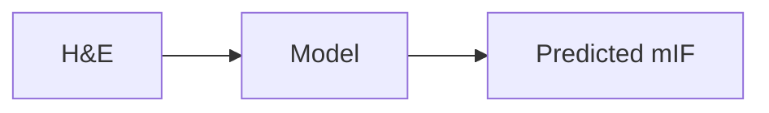

# Strand AI — Slide Decks

Marp-based slide decks for Strand AI. Each `.md` file in the repo root with `marp: true` frontmatter is a slide deck.

## Stack

- **Marp CLI** for rendering markdown → HTML / PDF / PPTX
- **Custom theme**: `themes/strand.css` (always use `theme: strand`)
- **Font**: PP Telegraf (UltraLight 200, Regular 400, Bold 700, Black 900)
- **Deploy**: GitHub Actions → Cloudflare Pages (`slides.strandai.bio`, behind Cloudflare Access)

## Creating a New Deck

Every deck starts with this frontmatter and title slide:

```markdown
---
marp: true
theme: strand
paginate: true
footer: "Strand AI  ·  Confidential"
---

<!-- _class: lead -->
<!-- _footer: "" -->
<!-- _paginate: false -->


```

The filename becomes the URL slug (e.g., `insitro.md` → `slides.strandai.bio/insitro.html`).

## Theme Classes

Set per-slide with `<!-- _class: name -->`:

- **(default)** — white background, dark text, pthalo green headings
- **`dark`** — pthalo green (#004D3B) background, light text
- **`lead`** — pthalo green background, centered, for title/section divider slides
- **`beige`** — ash beige (#F2F1ED) background
- **`slate`** — dark slate (#00120A) background, lightest text

## Color Palette

| Name | Hex | Usage |
|------|-----|-------|
| Pthalo | `#004D3B` | Primary brand, headings, `strong` text |
| Dark Slate | `#00120A` | Body text, darkest backgrounds |
| Ash Beige | `#F2F1ED` | Light backgrounds, code blocks |
| Ash Beige Dark | `#D9D1BB` | Borders, secondary text on dark |
| White | `#FFFFFF` | Light slide background |

## Slide Conventions

- **Pagination**: set `<!-- _paginate: false -->` on every slide (existing decks do this per-slide). The title/lead slide always has `<!-- _footer: "" -->` too.
- **Two-column layouts**: use a flex div pattern:
  ```html
  <div style="display:flex;gap:60px;margin-top:20px">
  <div style="flex:1">

  ### Left Column
  - content

  </div>
  <div style="flex:1">

  ### Right Column
  - content

  </div>
  </div>
  ```
- **Bold** text renders in pthalo green (via theme CSS) — use it for emphasis
- **Images**: place in `assets/`, reference as ``
- **Footnotes**: `<small style="margin-top:auto;color:#666">*Note text</small>`

## Assets

All static files (SVGs, fonts, images) live in `assets/`. The CI pipeline copies `assets/` into `dist/` for deployment.

Available logos:
- `assets/logo-white.svg` — white logo (for dark/lead slides)
- `assets/logo-pthalo.svg` — pthalo green logo (for light slides)
- `assets/logomark-white.svg` — white logomark only
- `assets/logomark-pthalo.svg` — pthalo green logomark only

## Mermaid Diagrams

Marp doesn't support Mermaid natively. We have a preprocessing pipeline that converts fenced ```` ```mermaid ```` blocks into inline base64 SVGs at build time.

**How it works**: `scripts/preprocess-mermaid.sh` finds mermaid code blocks, renders them to SVG via `mmdc` (@mermaid-js/mermaid-cli), and embeds the result as a base64 data URI image. The CI workflow (`.github/workflows/build-slides.yml`) runs this automatically before building.

**Usage** — just write standard mermaid in your markdown:

````markdown

````

**Sizing**: Mermaid blocks render as inline images. Control size with Marp image syntax by placing a size directive comment right before the block, or wrap in a div. The rendered output becomes ``.

**Local dev**: `npm run dev` does NOT preprocess mermaid — you'll see raw code blocks. Use `npm run build` or the CI pipeline to see rendered diagrams. To preview locally:

```bash
bash scripts/preprocess-mermaid.sh deck.md > .build/deck.md
npx marp .build/deck.md --html --allow-local-files --theme-set themes/
```

## Speaker Notes

Use HTML comments (that aren't Marp directives) as speaker notes:

```markdown
## Slide Title

Content here

<!--
- Talking point one
- Talking point two
-->
```

Visible in HTML presenter view (press **P**), PPTX (native notes), and PDF (`--pdf-notes` flag). Keep notes as short bulleted lists.

## Local Dev

```bash
npm run dev        # Live-reload server
npm run build      # Build HTML to dist/
npm run pdf        # Build PDF
npm run pptx       # Build PPTX
npm run check      # Validate slide layouts (overflow & collision detection)
```

## Tone

These are pitch decks for biopharma, biotech, and investors. Keep slides concise — one core idea per slide, assertion-style headings, evidence in bullets. Avoid filler. Bold the key phrases.
