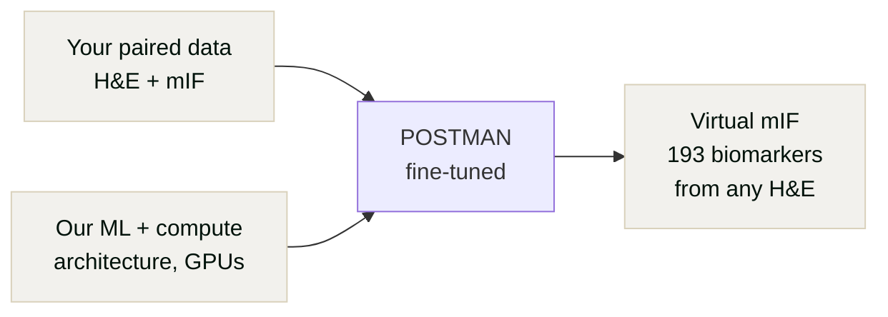
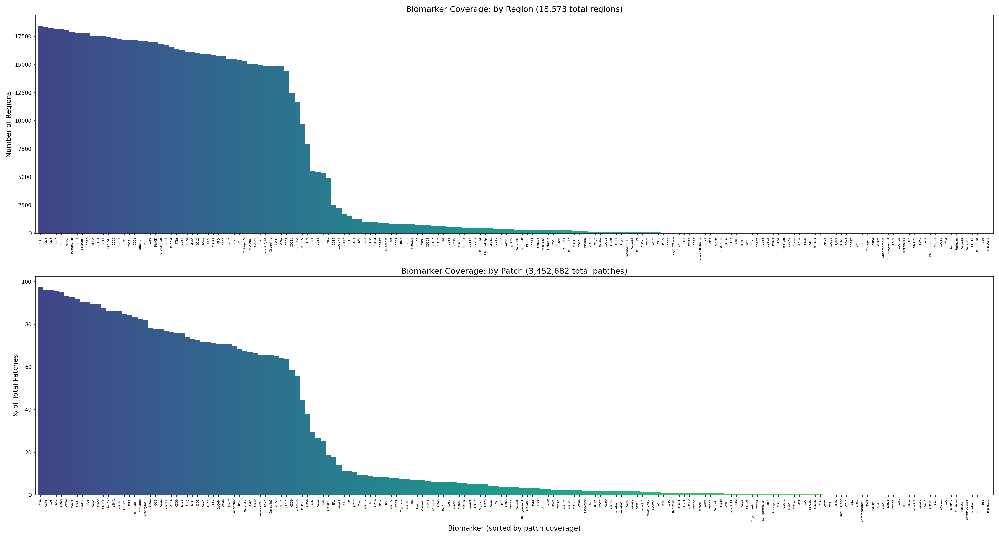
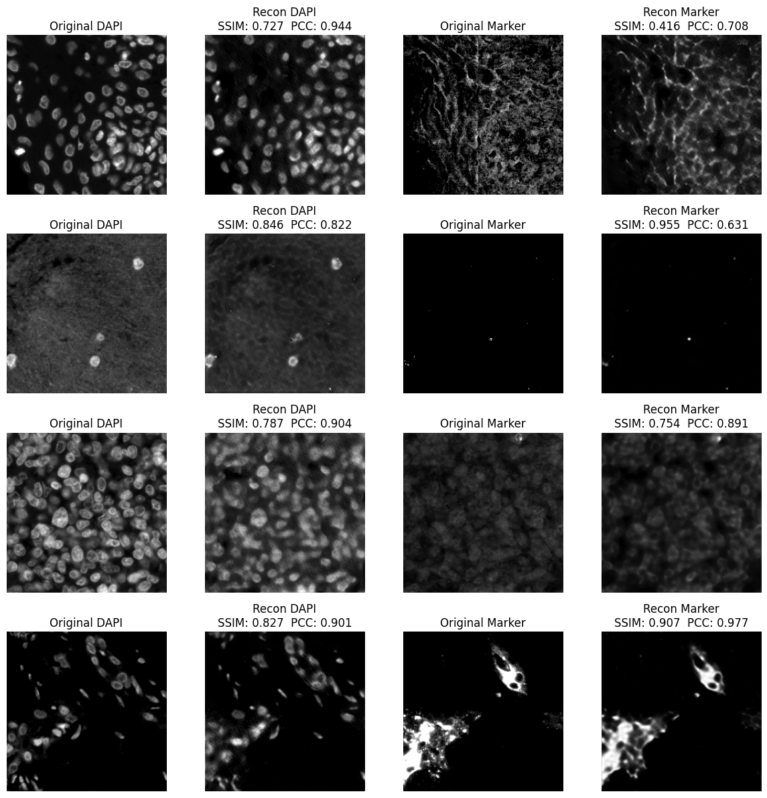
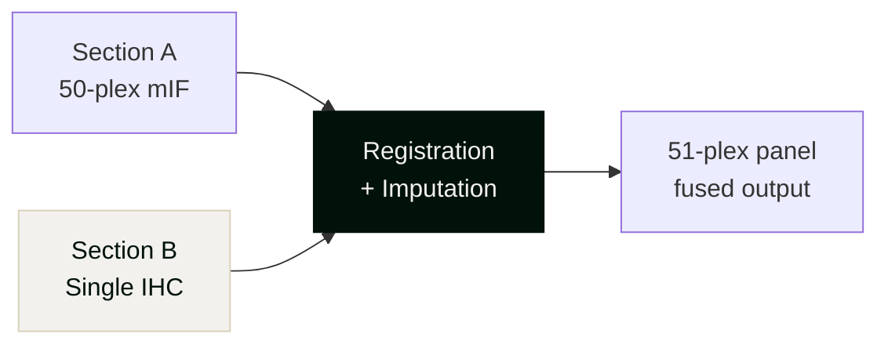

<!-- _class: lead -->
<!-- _footer: "" -->
<!-- _paginate: false -->

## Strand AI x Elucidate Bio

in-silico spatial omics at scale

<!--
- Oded: ex-Enable Medicine, petabyte-scale spatial biology platform
- Yue: ex-Enable / Pathos / Tempus AI, managed 1000+ H200s
- YC W26
-->

---

<!-- _class: dark -->
<!-- _paginate: false -->

## Recap: what you told us you need

- **H&E → proteomics** and **H&E → transcriptomics**
- Impute missing proteins onto your proteomic stack from IHC on serial sections
- Longer term: **predict any missing modality** from the other two (H&E, proteomics, transcriptomics)
- Correlations **> 0.8** — current published methods aren't there
- Validation against **patient outcomes**, not just reconstruction loss

The throughput bottleneck: spatial omics assays cost **$5-10K+ per slide** and take days. You can't run them on every sample.

<!--
- From Jan 20 call with Will + Gul
- Will: proteomics is primary, transcriptomics secondary
- Gul: asked about IHC → multiplex stack imputation
- Both want >0.8 PCC, validated on patient outcomes
- They know their assays can't scale: MACSima = days/round, RNAscope = 12 RNA targets max
-->

---

<!-- _paginate: false -->

## We looked into S2-omics & GHIST

### Where they fall short

- **S2-omics** — right idea, but doesn't scale and cell-type accuracy tops out at 76%
- **GHIST** — 2020-era backbone, PCC of **0.27 on top SVGs** — far below your 0.8 threshold
- Neither trained on data that looks like yours

### How we close the gap

- **Modern architectures** tailored to your needs — proteomic stack, gene expression, patient selection
- **Trained on your paired data** — your indications, your tissue types

<!--
- S2-omics: Nature Cell Bio 2025, smart ROI selection, 76% cell-type accuracy
- GHIST: Nature Methods 2025, PCC 0.27 on top 20 SVGs, 0.16 across all genes
- They asked us to look into these — show we did the homework
-->

---

<!-- _class: dark -->
<!-- _paginate: false -->

## The first step: H&E → mIF

Your paired data + our ML and compute expertise = **accelerate past SOTA**.

<!--
- POSTMAN is already training — not a proposal, a product
- Their single-slide multiomics (Sizun Jiang / MICSSS) = co-registered paired data
- Best possible training signal — no serial-section alignment artifacts
-->

---

<!-- _paginate: false -->

## POSTMAN: largest paired H&E to mIF prediction model

| Metric | Scope |
|--------|---------|
| Patches | **3.45M** (224x224) |
| Biomarkers | **193 unique** |
| Regions | 18,573 |
| Total size | **7.5 TB** |

### vs. published methods

- **5x more patches** than HEX (Nature Medicine, 2026)
- **9x more biomarkers** than GigaTIME (Cell, 2026)
- **4x more biomarkers** than ROSIE (Nature Comms, 2025)
- Pan-cancer, multi-site training data

<!--
- HEX: Nature Medicine 2026, 755K tiles, 10 patients, 40 biomarkers
- GigaTIME: Cell 2026, Microsoft/Providence, 21-channel mIF
- ROSIE: Nature Comms 2025, 50 proteins, 134M patches
- POSTMAN uses VAE + Flow Matching (MMDiT) architecture
-->

---

<!-- _paginate: false -->

## Biomarker coverage across 193 markers

<!-- Walk through the distribution — immune, structural, functional markers all covered -->

---

<!-- _paginate: false -->

## Early reconstruction results

<!-- Point to PCC/SSIM scores per marker — these are early results, expect improvement with fine-tuning -->

---

<!-- _paginate: false -->

## The cost equation changes entirely

Today: spatial proteomics costs **$5-10K/slide**, days of lab time, limits you to hundreds of patients.
With virtual staining: run the assay on a small subset, predict the rest — scale to **thousands**.

<!--
- MACSima can do 200+ proteins but ~1 day per staining round
- Their RNAscope HiPlex Pro caps at 12 RNA targets
- This is the slide where the FOMO lands — you can't scale without virtual staining
-->

---

<!-- _paginate: false -->

## Why POSTMAN matters for Elucidate

### Pan-cancer foundation

- Already predicts **193 spatially resolved biomarkers** from H&E
- Covers immune, structural, and functional markers
- **3.45M training patches** — largest paired dataset in the field

### Fine-tuned on your data

- We fine-tune on **your paired H&E + proteomics** to exceed published SOTA on your indications
- Your proprietary multimodal data = your **competitive moat**
- Different cancer types, different protein classes — handled by fine-tuning

<!-- Their proprietary paired data from Sizun Jiang's single-slide platform is uniquely valuable here — co-registered, not serial-section -->

---

<!-- _paginate: false -->

## H&E → spatial transcriptomics: same playbook

The same cost-reduction strategy applies to transcriptomics:

- Run spatial transcriptomics on a **small paired subset** (~$5-7K/slide)
- Train a custom model on that paired data using modern foundation model backbones
- Predict **gene expression across your full H&E archive** — no more $7K per slide
- We bring the **architecture, GPUs, and training expertise** — you bring the biology

<small style="margin-top:auto;color:#666">*The S2-omics approach (learn from a small paired region, predict the rest) but trained on your data, your indications, and pushed past their published benchmarks.</small>

<!--
- Their biggest RNA gap: RNAscope HiPlex Pro = 12 targets, not discovery-scale
- This slide addresses their weakest modality
- Will said transcriptomics is secondary but the need is real
-->

---

<!-- _paginate: false -->

## Expanding your proteomic panel from IHC

- No published method fuses **cross-section multiplex + IHC** into an expanded panel
- Closest work (7-UP, MIM-CyCIF, ExIF) only imputes within a **single section**
- We build the full pipeline: **registration + imputation + cross-stain translation**

<!--
- Gul's use case from Jan 20 call
- Will asked: how much signal from H&E (~20%) vs existing 50-plex (~80%)?
- Closest papers (all same-section only):
  - 7-UP: PNAS Nexus 2023, 7→40 plex
  - MIM-CyCIF: Comms Bio 2024, 9→25 channels
  - ExIF: NatComms 2025, anchoring channels concept
- Genuine open problem — nobody has published cross-section panel expansion
-->

---

<!-- _class: beige -->
<!-- _paginate: false -->

## What a design partnership looks like

### You provide

- Paired H&E + proteomics data (priority indication)
- Go/no-go correlation thresholds
- Priority protein targets
- Success criteria

### We deliver

- **Fine-tuned POSTMAN** on your paired data
- Per-protein correlation coefficients
- Morphological interpretability per prediction
- Deployable on your infrastructure or ours

<!-- We're taking only 2-3 design partnerships to ensure focus -->

---

<!-- _class: lead -->
<!-- _footer: "" -->
<!-- _paginate: false -->

### Proposed next steps

1. Scope the POC — define accuracy benchmarks, priority indications, target proteins

2. Index & catalog your paired data — determine what's available and what we need to hit your benchmarks

founders@strandai.com

