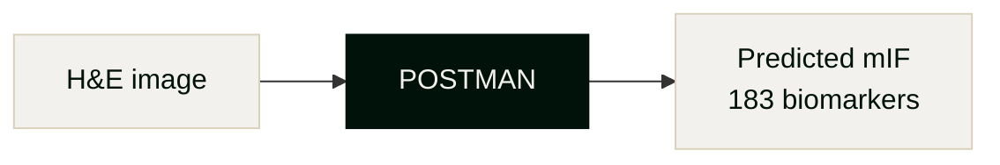

<!-- _class: lead -->
<!-- _footer: "" -->
<!-- _paginate: false -->

## POSTMAN
In Silico spatial proteomics from H&E

---

<!-- _class: dark -->
<!-- _paginate: false -->

## What if every H&E slide already contained spatial proteomics?

Every clinical trial generates **thousands of H&E slides**. The spatial protein information is encoded in the tissue morphology — we just couldn't read it. Until now.

POSTMAN unlocks **183 biomarkers** from routine histology — no wet lab, no extra tissue, no waiting.

<!--
- The hook: the data is already there, hidden in morphology
- Reframe H&E from "basic stain" to "information-rich source"
- This is the vision before we explain the problem/solution
-->

---

<!-- _class: dark -->
<!-- _paginate: false -->

## The problem: H&E archives are under-leveraged

- You have **thousands of H&E slides** — but most lack paired spatial proteomics
- Running mIF assays is **expensive** ($5-10K/slide) and slow (days per round)
- Many archived samples are **degraded or exhausted** — you can't run new assays on them
- Without spatial biomarker data, you're leaving **patient stratification insights** on the table

<!--
- This is the pain point: H&E is cheap and abundant, proteomics is expensive and scarce
- Degraded tissue = no re-staining possible
- AZ has massive H&E archives from trials that could be mined for biomarkers
-->

---

<!-- _paginate: false -->

## The solution: predict spatial proteomics from H&E

We trained on **7.5 TB of paired H&E + mIF data** — the largest dataset in the field.

- **3.45M patches** across **18,573 regions**
- Covers **183 unique biomarkers** — immune, structural, functional
- Pan-cancer, multi-site training data

<!--
- POSTMAN = Prediction Of Spatial Transcriptomics and Markers from ANatomic images
- This is not a proposal — the model is training now
- Dataset is 5x larger than HEX (Nature Medicine 2026)
-->

---

<!-- _paginate: false -->

## How POSTMAN beats published methods

### Training scale

| Method | Patches | Biomarkers |
|--------|---------|------------|
| HEX (2026) | 755K | 40 |
| ROSIE (2025) | — | 50 |
| GigaTIME (2026) | — | 21 |
| **POSTMAN** | **3.45M** | **183** |

### Architecture advantages

- **VAE + Flow Matching** — generates realistic spatial distributions, not blurry averages
- Predicts **spatially resolved** expression, not slide-level labels
- Fine-tunable to your indications and target panels

<!--
- HEX: Nature Medicine 2026, Microsoft/Providence
- ROSIE: Nature Comms 2025
- GigaTIME: Cell 2026
- Key differentiator: we generate spatial distributions, others predict aggregates
-->

---

<!-- _class: dark -->
<!-- _paginate: false -->

## The cost equation changes entirely

**Today**: spatial proteomics costs **$5-10K/slide**, limits you to hundreds of patients.

**With POSTMAN**: run the assay on a small subset, predict the rest.

### Traditional approach
100 slides × $7K = **$700K**
(and you can't re-run degraded samples)

### POSTMAN approach
10 slides × $7K + inference = **$70K**
(predict the other 90 from H&E)

<!--
- 10x cost reduction is conservative
- Real value: you can analyze samples you physically can't re-stain
- Enables retrospective analysis of trial archives
-->

---

<!-- _paginate: false -->

## Status and timeline

### Current status

- Model: **Training**
- Dataset: 7.5 TB indexed and preprocessed
- Early reconstructions showing strong PCC/SSIM

### Validation plan

- **Reconstruction metrics** — PCC, SSIM per biomarker
- **Cox regression** — overall survival prediction
- Open to **additional validations** AZ wants to see

### Future work

- Perturbation prediction — how would biomarker expression change under treatment?
- Fine-tuning on AZ-specific indications and panels

<!--
- Training expected complete by mid-Feb
- Happy to discuss what validation endpoints matter most to AZ
- Perturbation is the longer-term vision: predict counterfactuals
-->

---

<!-- _class: beige -->
<!-- _footer: "" -->
<!-- _paginate: false -->

### Next steps

1. **Define validation criteria** — which biomarkers, which indications, what correlation thresholds?

2. **Share paired data** (optional) — fine-tuning on AZ data will outperform generic model

3. **Pilot on your H&E archive** — pick a cohort, we run inference, you validate

